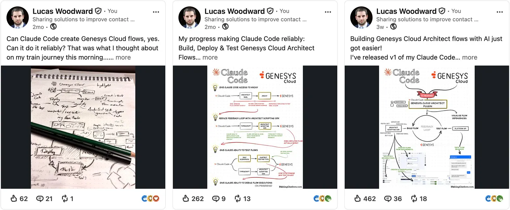

# Claude Code Plugin: Genesys Cloud Architect

[](https://www.linkedin.com/in/lucas-woodward-the-dev/)

Claude Code plugin for anyone working with Genesys Cloud's Architect flows that want to:

* [Create architect flows of any type](#create-flows)
* [Run automated tests against Digital flows](#test-flows)
* [Create and test flow expressions](#create-and-test-flow-expressions)
* [Inspect and fix issues in flows](#inspect-and-fix-issues-in-flows)
* [Document flows](#document-flows)
* _and more..._

## Getting started

Follow the [installation guide](#installation), then tell Claude Code what you want to do:

### Create flows

> Create a Digital Bot flow to do X, and run numerous tests to catch any edge-cases...

> Create an inbound call flow that routes callers to queues by DNIS...

[Example of a flow being created](https://makingchatbots.com/i/200764669/create-your-flows-with-ai).

### Test flows

### Create and test flow expressions

### Inspect and fix issues in flows

### Document flows


## Installation

1. Open Claude Code
2. Type the following to add the marketplace and install the plugin:
   1. Add the marketplace
      ```
      /plugin marketplace add MakingChatbots/genesys-cloud-plugins
      ```

   2. Install the plugin
      ```
      /plugin install genesys-cloud-architect@makingchatbots-genesys-cloud-plugins
      ```
3. When asked, provide the Credentials for an OAuth Client with the following permissions:
   * `Architect > Flow > *`
   * `Architect > Job > *`
   * `Architect > UI > *`
   * `Language Understanding > NLU Domain Version > View`
   * `Textbots > *`
   * `Architect > Dependency Tracking > View`

## Who built this?

This was built by me, [Lucas Woodward]([https://www.linkedin.com/in/lucas-woodward-the-dev/](https://makingchatbots.com/about#§who-am-i)).

I've been building this in public - engaging with the Genesys community with each milestone.
[Follow me on LinkedIn to join in](https://www.linkedin.com/in/lucas-woodward-the-dev/).



What else have I built:

* [Genesys Cloud MCP Server](https://github.com/MakingChatbots/genesys-cloud-mcp-server)
* [Genesys Cloud n8n community node](https://github.com/MakingChatbots/n8n-nodes-genesys-cloud)
* [Genesys Cloud Chatbot Tester](https://github.com/MakingChatbots/genesys-cloud-chatbot-tester)
* _many more on [my newsletter...](https://makingchatbots.com/)_

## Development

Docs to help understand how this works, or contribute:

* [docs/development.md](docs/development.md)
* [docs/architectural-decisions.md](docs/architectural-decisions.md)
