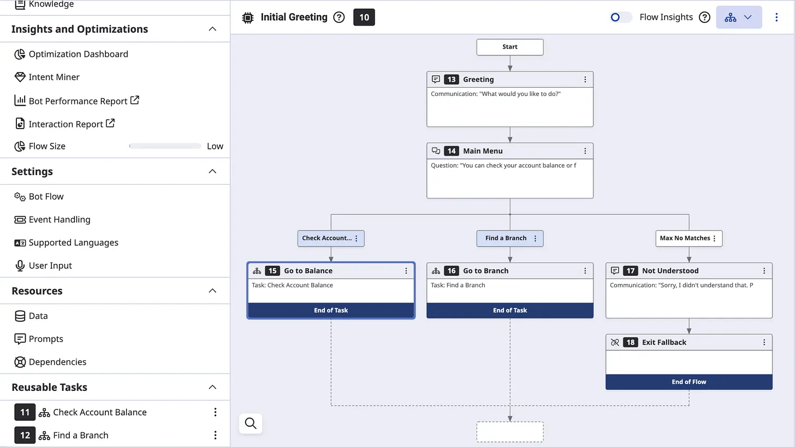
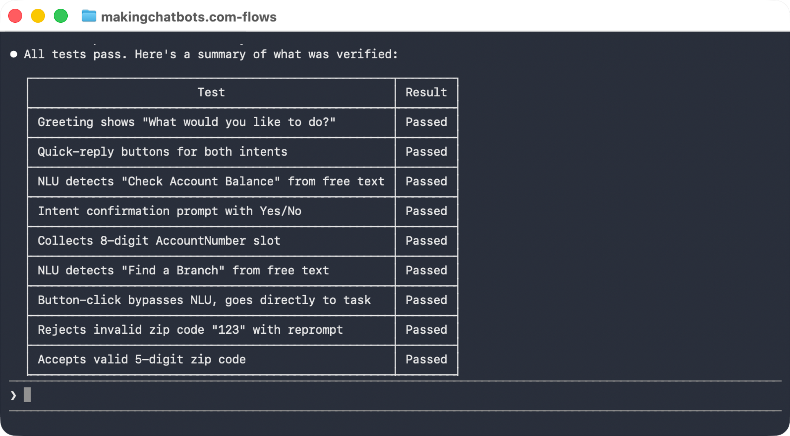
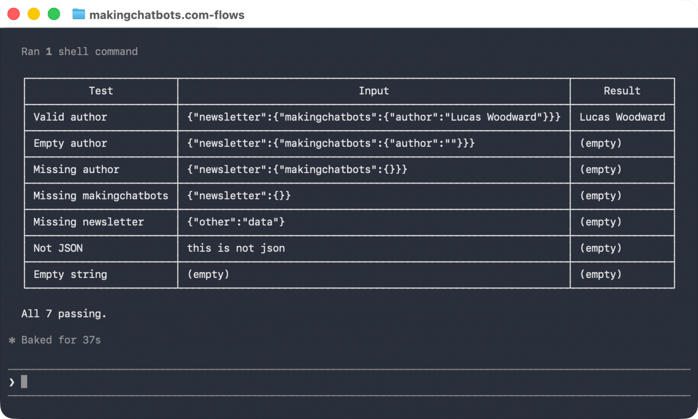

# Claude Code Plugin: Genesys Cloud Architect

[](https://www.linkedin.com/in/lucas-woodward-the-dev/)

Claude Code plugin for anyone working with Genesys Cloud's Architect flows that want to:

* [Create architect flows of any type](#create-architect-flows-of-any-type)
* [Run automated tests against Digital flows](#run-automated-tests-against-digital-flows)
* [Create and test flow expressions](#create-and-test-flow-expressions)
* [Inspect and fix issues in flows](#inspect-and-fix-issues-in-flows)
* [Document flows](#document-flows)
* _and more..._

## Getting started

Follow the [installation guide](#installation), then simply tell Claude Code what you want it to do.

Below are examples of each of its capabilities:

### Create architect flows of any type

Asking Claude Code to create a flow will have it create, publish and test a flow using the [Architect Scripting SDK](https://mypurecloud.github.io/purecloud-flow-scripting-api-sdk-javascript/).

Below is an example of a simple flow, but they can be much more complex:

> Create a Bank bot flow with two intents: "Check Account Balance" (collects an 8-digit AccountNumber slot) and "Find a Branch" (collects a 5-digit ZipCode slot).
>
> The bot:
> 1. Asks "What would you like to do?"
> 2. Detects the intent
> 3. Then asks for the relevant slot
> 4. Exit the bot flow after slot collection
> 
> Include 6 utterances per intent with entity-annotated examples.
> Add intent confirmation prompts like "I think you want to [intent], is that correct?"
> 
> Publish the flow, and test it frequently as you build it.

Resulting in a flow:



[Read more...](https://makingchatbots.com/i/200764669/create-your-flows-with-ai)

### Run automated tests against Digital flows

The plugin allows Claude Code to run tests against Digital bot flows. This is useful when
it's developing flows, or simply to test for edge-cases in existing flows:

> Inspect the 'Bank bot' flow and run tests against it to ensure it behaves as expected.



### Create and test flow expressions

> My Genesys Architect flow needs to extract the 'author' from the JSON retrieved from a participant attribute below:
>
> { "newsletter": {"makingchatbots": {"author": "Lucas Woodward "}}
>
> Create an expression that returns the value of 'author'. However, if the property (or any of the parent properties) do not exist then return an empty value.
>
> Create a Digital Bot flow to test your expression against different test cases.




[Read more...](https://makingchatbots.com/i/200764669/create-and-test-expressions)

### Inspect and fix issues in flows

TODO Add example

### Document flows

TODO Add example

## Installation

1. Open Claude Code
2. Type the following to add the marketplace and install the plugin:
   1. Add the marketplace
      ```
      /plugin marketplace add MakingChatbots/genesys-cloud-plugins
      ```

   2. Install the plugin
      ```
      /plugin install genesys-cloud-architect@makingchatbots-genesys-cloud-plugins
      ```
3. When asked, provide the Credentials for an OAuth Client with the following permissions:
   * `Architect > Flow > *`
   * `Architect > Job > *`
   * `Architect > UI > *`
   * `Language Understanding > NLU Domain Version > View`
   * `Textbots > *`
   * `Architect > Dependency Tracking > View`

## Who built this?

This is built by [Lucas Woodward](https://makingchatbots.com/about#§who-am-i).

I've been building this in public - engaging with the Genesys community with each milestone. If you'd like to keep up
to date with releases then [follow me on LinkedIn](https://www.linkedin.com/in/lucas-woodward-the-dev/).

What else I have built:

* [Genesys Cloud MCP Server](https://github.com/MakingChatbots/genesys-cloud-mcp-server)
* [Genesys Cloud n8n community node](https://github.com/MakingChatbots/n8n-nodes-genesys-cloud)
* [Genesys Cloud Chatbot Tester](https://github.com/MakingChatbots/genesys-cloud-chatbot-tester)
* _many more on [my newsletter...](https://makingchatbots.com/)_

## Development

Docs to help understand how this works, or contribute:

* [docs/development.md](docs/development.md)
* [docs/architectural-decisions.md](docs/architectural-decisions.md)
