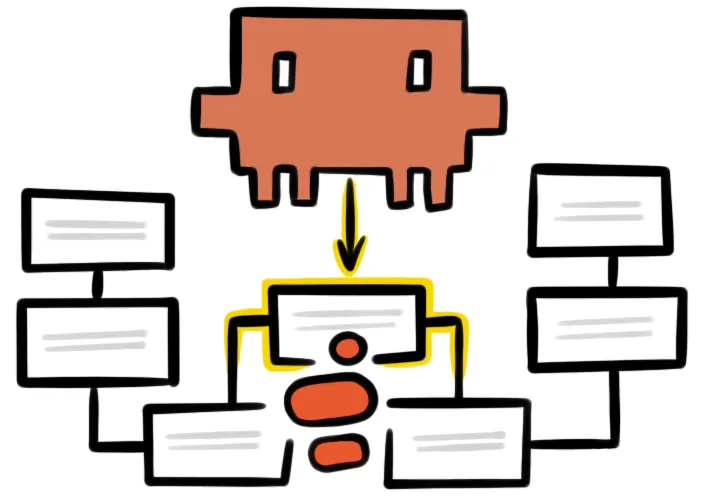
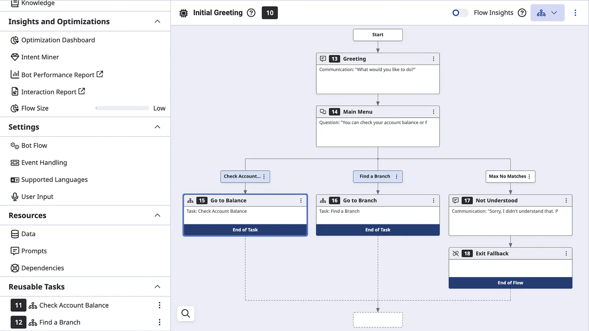
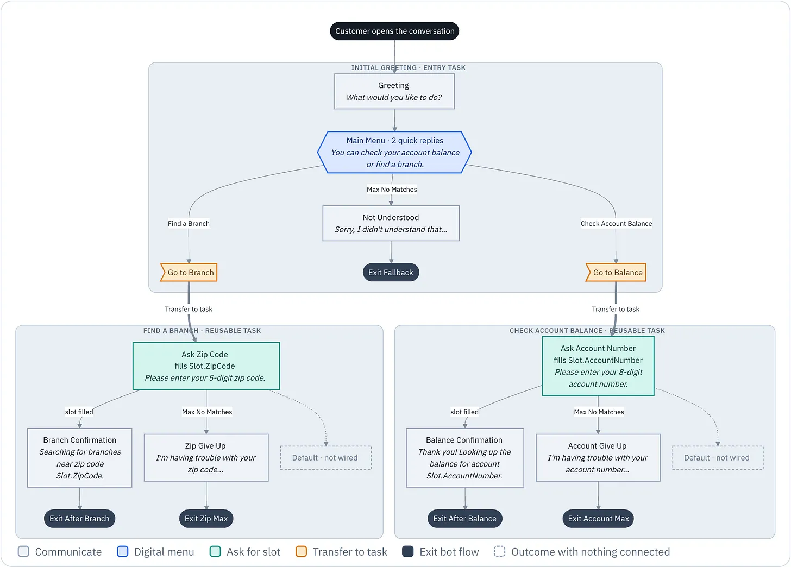
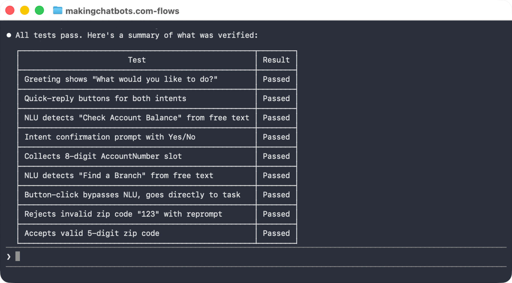
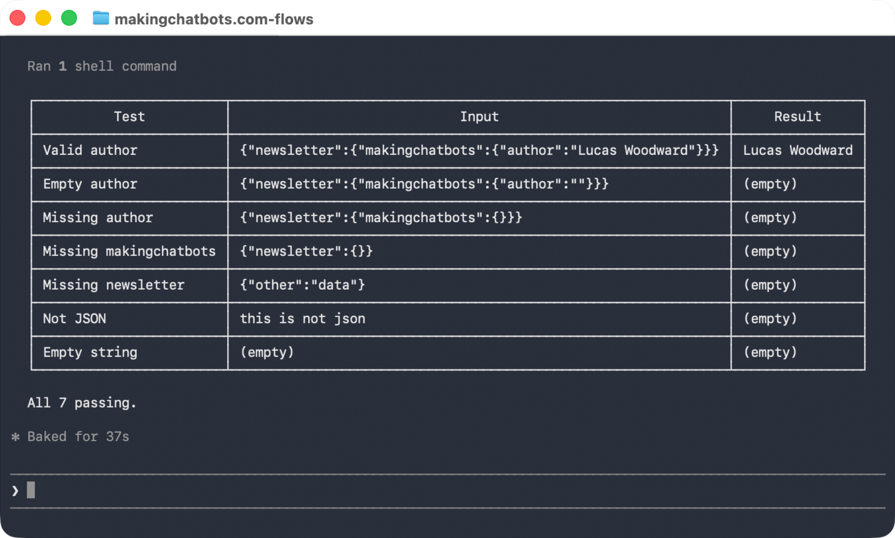
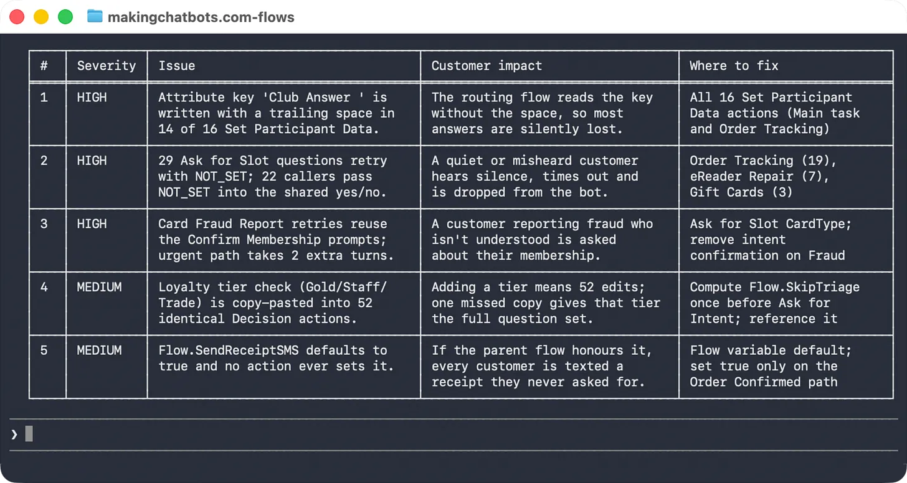
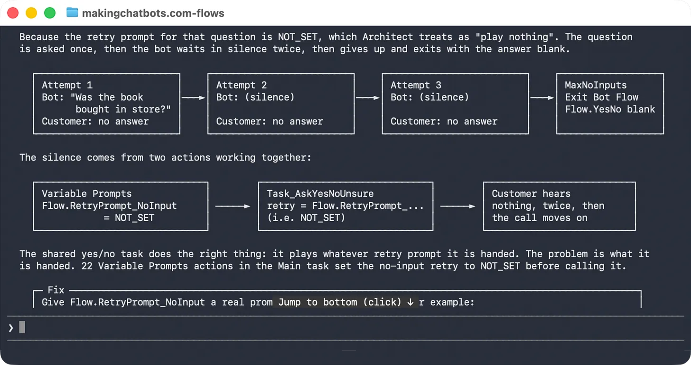

# Claude Code Plugin: Genesys Cloud Architect

<p align="center">
  
</p>

Use Claude Code to create, test, diagnose and document your Genesys Cloud's Architect flows.

This plugin allows you to:

* [Create architect flows of any type](#create-architect-flows-of-any-type)
* [Document an entire flow](#document-an-entire-flow)
* [Run automated tests against Digital flows](#run-automated-tests-against-digital-flows)
* [Create flow expressions](#create-flow-expressions)
* [Identify issues with a flow](#identify-issues-with-a-flow)
* [Asking questions of a flow](#asking-questions-of-a-flow)
* _and more..._

## Installation

1. Open Claude Code
2. Type the following to add the marketplace for the plugin and install it:
   1. Add the marketplace
      ```
      /plugin marketplace add MakingChatbots/genesys-cloud-plugins
      ```

   2. Install the plugin
      ```
      /plugin install genesys-cloud-architect@makingchatbots-genesys-cloud-plugins
      ```
3. When asked, provide the Credentials for an OAuth Client with the following permissions:
   * `Architect > Flow > *`
   * `Architect > Job > *`
   * `Architect > UI > *`
   * `Language Understanding > NLU Domain Version > View`
   * `Textbots > *`
   * `Architect > Dependency Tracking > View`
   * `Routing > Queue > View`
   * `Architect > Flow Instance > View`
   * `Architect > Flow Instance > Search`
   * `Architect > Flow Instance Execution Data > View`
   * `Architect > User Prompt > View`

## Usage

Once you've installed the plugin simply ask Claude to create, explain, test, diagnose flow, and much more...

Here are some examples of what it can do:

### Create architect flows of any type

Manually dragging boxes in Architect can now become a thing of the past. Simply tell Claude what
you want the flow to do and have it create, publish and test it using the [Architect Scripting SDK](https://mypurecloud.github.io/purecloud-flow-scripting-api-sdk-javascript/):

> Create a Bank bot flow with two intents: "Check Account Balance" (collects an 8-digit AccountNumber slot) and "Find a Branch" (collects a 5-digit ZipCode slot).
>
> The bot:
> 1. Asks "What would you like to do?"
> 2. Detects the intent
> 3. Then asks for the relevant slot
> 4. Exit the bot flow after slot collection
> 
> Include 6 utterances per intent with entity-annotated examples.
> Add intent confirmation prompts like "I think you want to [intent], is that correct?"
> 
> Publish the flow, and test it frequently as you build it.

Resulting in a flow:



[Read more...](https://makingchatbots.com/i/200764669/create-your-flows-with-ai)

### Document an entire flow

The more complex a flow becomes the harder it is to understand. Since this plugin allows Claude Code to
understand flows, it can be used to document them too...

> Document the flow "Bank Bot".
>
> Show me how it hangs together, quote what the bot actually says at each step,
> and flag anything that looks wrong.
>
> If it is too big for one diagram, split it by responsibility.



[Read more...](https://makingchatbots.com/i/213933939/documenting-your-flows-with-ai)

### Run automated tests against Digital flows

The plugin allows Claude Code to run tests against Digital bot flows. This is useful when
it's developing flows, or simply to test for edge-cases in existing flows:

> Inspect the 'Bank bot' flow and run tests against it to ensure it behaves as expected.



### Create flow expressions

The plugin can create expressions for you, along with an explanation of how they work. It does this by creating
a test harness in a Digital bot flow which it can then create and test the expression in.

> My Genesys Architect flow needs to extract the 'author' from the JSON retrieved from a participant attribute below:
>
> { "newsletter": {"makingchatbots": {"author": "Lucas Woodward "}}
>
> Create an expression that returns the value of 'author'. However, if the property (or any of the parent properties) do not exist then return an empty value.
>
> Create a Digital Bot flow to test your expression against different test cases.



[Read more...](https://makingchatbots.com/i/200764669/create-and-test-expressions)

### Identify issues with a flow

Issues in flows can easily go unnoticed, quietly affecting customers. They're now easily identified by simply asking
Claude Code to look for them:

> Review the flow "Main Intent Router" for problems.
> 
> Give me a table of every issue you find, ordered by severity,
> with what it would mean for a customer and where in the flow to fix it.



[Read more...](https://makingchatbots.com/i/213933939/identify-issues-with-a-flows)

### Asking questions of a flow

It isn't always easy to know why or how the flow behaves in a particular way, so now
you can ask how parts of your flow work:

> Explain why the "Was the book bought in store?" question in the flow
> "Main Intent Router" goes silent when the customer doesn't answer.
>
> Use simple illustrations to help me understand.



[Read more...](https://makingchatbots.com/i/213933939/asking-questions-of-a-flow)

## Who built this?

This is built by me, [Lucas Woodward](https://makingchatbots.com/about#§who-am-i).

I've been building this in public, and engaging with the Genesys community with each milestone.
If you'd like to keep up to date with releases then [follow me on LinkedIn](https://www.linkedin.com/in/lucas-woodward-the-dev/).

These are some of the other projects I've built:

* [Genesys Cloud MCP Server](https://github.com/MakingChatbots/genesys-cloud-mcp-server)
* [Genesys Cloud n8n community node](https://github.com/MakingChatbots/n8n-nodes-genesys-cloud)
* [Genesys Cloud Chatbot Tester](https://github.com/MakingChatbots/genesys-cloud-chatbot-tester)
* _many more on [my newsletter...](https://makingchatbots.com/)_

## Development

Docs to help understand how this works, or contribute:

* [docs/development.md](docs/development.md)
* [docs/architectural-decisions.md](docs/architectural-decisions.md)
