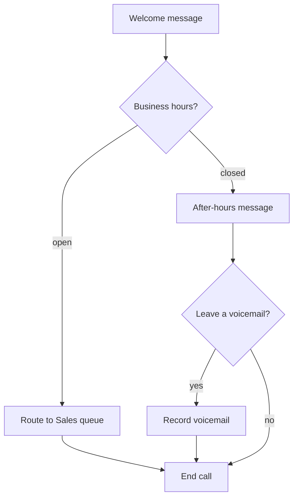
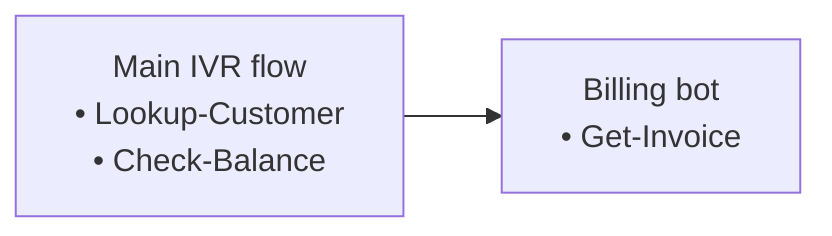

# Flow Diagram Skill

Create flow diagrams as Mermaid — text-based with automatic layout. Mermaid is diffable, cheap to generate, and renders natively in GitHub markdown (READMEs, PR and issue descriptions), Claude artifacts, and most docs tooling.

For graphs with fewer than 3 nodes or no edges, prefer plain text (ASCII or a markdown table) — not worth a diagram.

## Workflow

### 1. Pick the diagram type

| Data | Mermaid type |
|---|---|
| Flows, pipelines, decision branches | `flowchart TD` (or `LR` for wide/shallow graphs) |
| State machines | `stateDiagram-v2` |
| Dependencies, architecture maps | `flowchart LR` with `subgraph` groupings |
| Sequences of calls between systems | `sequenceDiagram` |

### 2. Write the diagram



Syntax gotchas:
- Quote any label containing parentheses, colons, or other punctuation: `A["Play message (after hours)"]`
- `end` (lowercase) is a reserved word in flowcharts — use a different node id like `Finish`
- Edge labels use pipes: `A -->|open| B`
- Colour node categories with `classDef` + `class`, e.g. `classDef queue fill:#1d4ed8,color:#fff` then `class Queue queue`

### 3. Deliver it where it will actually render

Mermaid source is only a picture where something renders it. A fenced block printed into a Claude Code terminal shows as **raw source text, not a diagram** — so pick the delivery form from the destination:

| Destination | Deliver as |
|---|---|
| GitHub PR or issue description, README, a committed `.md` file | Fenced ` ```mermaid ` block — inline in the response for the user to paste, or written to the file |
| The user wants to look at the diagram now, in a Claude Code session ("show me", "let me see it") | A standalone HTML file they can open (section 5), or a published Artifact — never bare source in the terminal |
| Web or desktop chat, or docs tooling that renders Mermaid | Fenced ` ```mermaid ` block |

When delivering a file or Artifact, still show the Mermaid source inline if it is short — it is the reviewable, diffable form.

### 4. Nodes with internal detail

When a node needs to show a list of sub-items (e.g., a flow listing the data actions it calls), use multi-line labels with `<br/>` bullets, or group children in a `subgraph`:



### 5. Standalone HTML

To give the user something openable in a browser, wrap the diagram. The page background must match the Mermaid theme — a `dark` theme diagram on a default white page is washed out and low contrast:

```html
<!doctype html>
<html>
<body style="margin:0;padding:24px;background:#0f172a">
<pre class="mermaid">
flowchart TD
    A["..."] --> B["..."]
</pre>
<script type="module">
  import mermaid from 'https://cdn.jsdelivr.net/npm/mermaid@11/dist/mermaid.esm.min.mjs';
  mermaid.initialize({ startOnLoad: true, theme: 'dark' });
</script>
</body>
</html>
```

This wrapper needs internet access when opened (Mermaid loads from a CDN); the markdown form has no such dependency.

## Limits

- Layout is automatic and cannot be hand-tuned. For dense graphs (30+ heavily cross-linked nodes), split into multiple diagrams or use `subgraph` groupings rather than fighting the layout.
- Output is static — no pan, zoom, or drag. If the user asks for an interactive or explorable diagram, say plainly that this skill produces static Mermaid diagrams, then offer a browser-viewable HTML file (section 5) and splitting a large graph into focused views. Do not build a bespoke interactive diagram instead.